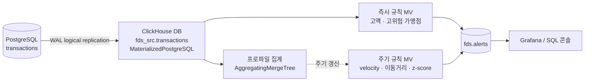

# 카드 FDS 실시간 파이프라인 (PostgreSQL → ClickHouse)

거래 DB(PostgreSQL)의 트랜잭션을 논리 복제(Logical Replication)로 ClickHouse에 실시간 반영하고, ClickHouse 안에서 규칙 기반 이상거래 탐지까지 수행하는 데모 구성 가이드입니다.

```
PostgreSQL          ClickHouse                 MV 규칙 엔진              alerts 테이블
transactions  --(WAL, logical)-->  MaterializedPostgreSQL DB  ---->  즉시규칙 / 프로파일 / 주기규칙  ---->  fds.alerts
```

---

## 0. 개요와 설계 원칙

CDC 방식은 여러 가지가 있지만, 이 가이드는 **ClickHouse의 `MaterializedPostgreSQL` 데이터베이스 엔진**을 사용합니다. Kafka나 Debezium 같은 별도 인프라 없이 ClickHouse가 PostgreSQL의 논리 복제 프로토콜(pgoutput)을 직접 구독하기 때문에, 구성 요소가 PostgreSQL과 ClickHouse 두 개뿐이라 데모 목적에 가장 적합합니다.

탐지 규칙은 두 층으로 나눕니다.

- **즉시 규칙**: 행 하나만 보고 바로 판단 가능 (트리거형 Materialized View)
- **주기 규칙**: 최근 히스토리나 카드별 프로파일과 비교 필요 (Refreshable Materialized View, 몇 초 주기 재계산)



---

## 1. 사전 준비

| 구성 요소 | 권장 버전 / 비고 |
|---|---|
| PostgreSQL | 11 이상 (`pg_replication_slot_advance` 함수 필요) |
| ClickHouse | 최신 안정 버전. `MaterializedPostgreSQL`은 여전히 **실험적 기능**이며 ClickHouse Cloud에서는 지원되지 않음 (자체 호스팅 또는 로컬 Docker 사용) |
| 네트워크 | ClickHouse가 PostgreSQL의 5432 포트에 접근 가능해야 함 |
| 시각화 (선택) | Grafana + ClickHouse 데이터소스 플러그인, 또는 `clickhouse-client` / Play UI로 대체 가능 |

가장 빠른 방법은 Docker로 두 컨테이너(`postgres`, `clickhouse-server`)를 같은 네트워크에 띄우는 것입니다. 이 문서는 두 컨테이너의 호스트명을 각각 `postgres`, `clickhouse`로 가정합니다.

---

## 2. PostgreSQL 설정

### 2-1. 논리 복제 활성화

`postgresql.conf`

```conf
wal_level = logical
max_replication_slots = 4
max_wal_senders = 4
```

> 설정 변경 후 PostgreSQL 재시작이 필요합니다 (`wal_level`은 재시작 필수 파라미터).

### 2-2. 데모용 거래 테이블

기본키가 있으면 별도 REPLICA IDENTITY 설정 없이도 그대로 복제됩니다.

```sql
CREATE TABLE transactions (
    tx_id        BIGSERIAL PRIMARY KEY,
    card_id      BIGINT NOT NULL,
    merchant_id  BIGINT NOT NULL,
    mcc          VARCHAR(4),              -- 가맹점 업종 코드
    amount       NUMERIC(12,2) NOT NULL,
    currency     CHAR(3) DEFAULT 'KRW',
    city         VARCHAR(100),
    country      CHAR(2),
    device_id    VARCHAR(64),
    is_online    BOOLEAN DEFAULT false,
    tx_time      TIMESTAMPTZ NOT NULL DEFAULT now()
);
```

### 2-3. 복제 전용 사용자

```sql
CREATE ROLE ch_replicator WITH REPLICATION LOGIN PASSWORD 'change_me';
GRANT CONNECT ON DATABASE cards_db TO ch_replicator;
GRANT CREATE ON DATABASE cards_db TO ch_replicator;   -- CREATE PUBLICATION 권한용
GRANT USAGE ON SCHEMA public TO ch_replicator;
GRANT SELECT ON ALL TABLES IN SCHEMA public TO ch_replicator;
ALTER DEFAULT PRIVILEGES IN SCHEMA public GRANT SELECT ON TABLES TO ch_replicator;
```

ClickHouse는 이 사용자로 접속해 자체적으로 `CREATE PUBLICATION`과 복제 슬롯 생성을 수행합니다. 운영 환경이라면 `CREATE` 권한 범위를 더 좁히고, 필요한 테이블만 퍼블리케이션에 포함시키는 것을 권장합니다.

### 2-4. 원격 접속 허용 (Docker 등 컨테이너 환경)

`pg_hba.conf`

```conf
host    replication    ch_replicator    0.0.0.0/0    md5
host    cards_db       ch_replicator    0.0.0.0/0    md5
```

---

## 3. ClickHouse 복제 설정

`MaterializedPostgreSQL`은 실험적 기능이므로 먼저 플래그를 켭니다.

```sql
SET allow_experimental_database_materialized_postgresql = 1;
```

### 3-1. 복제 데이터베이스 생성

```sql
CREATE DATABASE fds_src
ENGINE = MaterializedPostgreSQL('postgres:5432', 'cards_db', 'ch_replicator', 'change_me')
SETTINGS materialized_postgresql_tables_list = 'transactions';
```

**내부적으로 무슨 일이 벌어지나** — `fds_src.transactions`는 사실 `ReplacingMergeTree` 엔진의 nested 테이블입니다. 매 UPDATE/DELETE는 새 버전의 행 삽입으로 처리되고, 조회 시 ClickHouse가 자동으로 최신 버전만 보여줍니다. 이 구조 덕분에 뒤에서 만들 Materialized View가 "새 행이 삽입될 때마다" 정상적으로 트리거됩니다.

### 3-2. 여러 테이블 / 스키마를 복제할 때

```sql
SETTINGS materialized_postgresql_tables_list = 'transactions,cards,merchants'
```

새 테이블은 자동으로 복제에 추가되지 않습니다. 나중에 테이블을 더할 땐 `ATTACH TABLE fds_src.new_table;`을 실행하세요.

---

## 4. 동기화 검증

```sql
-- ClickHouse에서 복제된 테이블 확인
SHOW TABLES FROM fds_src;
SELECT count() FROM fds_src.transactions;
```

실시간 반영을 체감하려면 PostgreSQL에서 직접 행을 하나 넣고, 몇 초 뒤 ClickHouse에서 조회해보면 됩니다.

```sql
-- PostgreSQL
INSERT INTO transactions (card_id, merchant_id, mcc, amount, city, country, device_id, tx_time)
VALUES (1001, 55, '5411', 128000, 'Seoul', 'KR', 'dev-aa11', now());

-- ClickHouse (몇 초 후)
SELECT * FROM fds_src.transactions WHERE card_id = 1001 ORDER BY tx_time DESC LIMIT 1;
```

지연은 보통 1~3초 수준입니다.

---

## 5. 이상거래 탐지 레이어

| 규칙 | 심각도 | 설명 | 유형 |
|---|---|---|---|
| HIGH_AMOUNT | high | 단일 거래 금액이 절대 임계치 초과 | 즉시 |
| VELOCITY | medium | 같은 카드로 N분 내 M건 이상 결제 | 주기 |
| IMPOSSIBLE_TRAVEL | high | 짧은 시간 내 지리적으로 먼 두 지역에서 결제 | 주기 |
| AMOUNT_ZSCORE | high | 카드별 평균·표준편차 대비 급격히 큰 금액 | 주기 + 프로파일 |

### 5-1. alerts 결과 테이블

```sql
CREATE DATABASE fds;

CREATE TABLE fds.alerts
(
    alert_time DateTime DEFAULT now(),
    tx_id      UInt64,
    card_id    UInt64,
    rule       LowCardinality(String),
    severity   LowCardinality(String),
    amount     Decimal(12,2),
    detail     String
)
ENGINE = MergeTree
ORDER BY (alert_time, card_id);
```

### 5-2. 즉시 규칙 — 고액 거래 (트리거형 MV)

새 행이 `fds_src.transactions`에 삽입되는 즉시 실행되어 alerts에 바로 적재됩니다.

```sql
CREATE MATERIALIZED VIEW fds.mv_high_amount
TO fds.alerts
AS
SELECT
    now()                                              AS alert_time,
    tx_id,
    card_id,
    'HIGH_AMOUNT'                                       AS rule,
    'high'                                               AS severity,
    amount,
    concat('단일 거래 ', toString(amount), '원 - 임계치 초과')  AS detail
FROM fds_src.transactions
WHERE amount > 3000000;
```

### 5-3. 카드별 프로파일 집계 (AggregatingMergeTree)

이후 규칙들이 참조할 "카드별 평소 패턴"을 실시간으로 누적 집계합니다.

```sql
CREATE TABLE fds.card_profile_state
(
    card_id       UInt64,
    amount_avg    AggregateFunction(avg, Decimal(12,2)),
    amount_std    AggregateFunction(stddevPop, Decimal(12,2)),
    last_country  AggregateFunction(argMax, FixedString(2), DateTime),
    last_city     AggregateFunction(argMax, String, DateTime),
    last_tx_time  AggregateFunction(max, DateTime)
)
ENGINE = AggregatingMergeTree
ORDER BY card_id;

CREATE MATERIALIZED VIEW fds.mv_card_profile
TO fds.card_profile_state
AS
SELECT
    card_id,
    avgState(amount)                 AS amount_avg,
    stddevPopState(amount)           AS amount_std,
    argMaxState(country, tx_time)    AS last_country,
    argMaxState(city, tx_time)       AS last_city,
    maxState(tx_time)                AS last_tx_time
FROM fds_src.transactions
GROUP BY card_id;
```

몇 초 주기로 "확정 스냅샷" 테이블로 병합해두면, 다른 규칙에서 조인용으로 가볍게 읽을 수 있습니다.

```sql
CREATE TABLE fds.card_profile_snapshot
(
    card_id      UInt64,
    amount_avg   Float64,
    amount_std   Float64,
    last_country FixedString(2),
    last_city    String,
    last_tx_time DateTime
)
ENGINE = ReplacingMergeTree(last_tx_time)
ORDER BY card_id;

CREATE MATERIALIZED VIEW fds.mv_profile_snapshot
REFRESH EVERY 10 SECOND
TO fds.card_profile_snapshot
AS
SELECT
    card_id,
    avgMerge(amount_avg)              AS amount_avg,
    stddevPopMerge(amount_std)        AS amount_std,
    argMaxMerge(last_country)         AS last_country,
    argMaxMerge(last_city)            AS last_city,
    maxMerge(last_tx_time)            AS last_tx_time
FROM fds.card_profile_state
GROUP BY card_id;
```

> **버전 참고**: Refreshable Materialized View는 비교적 최근 기능입니다. 사용 중인 버전에서 `allow_experimental_refreshable_materialized_view` 설정이 필요할 수 있으니, 데모 환경 버전 문서를 먼저 확인하세요.

### 5-4. 주기 규칙 — velocity (짧은 시간 다발 결제)

`APPEND`를 붙이면 매 주기마다 테이블을 통째로 교체하지 않고 새로 발견된 결과만 이어 붙입니다.

```sql
CREATE MATERIALIZED VIEW fds.mv_velocity
REFRESH EVERY 10 SECOND APPEND
TO fds.alerts
AS
SELECT
    now()                                              AS alert_time,
    argMax(tx_id, tx_time)                              AS tx_id,
    card_id,
    'VELOCITY'                                           AS rule,
    'medium'                                             AS severity,
    sum(amount)                                          AS amount,
    concat('최근 5분간 ', toString(count()), '건, 합계 ', toString(sum(amount)), '원') AS detail
FROM fds_src.transactions
WHERE tx_time >= now() - INTERVAL 5 MINUTE
GROUP BY card_id
HAVING count() >= 5;
```

### 5-5. 주기 규칙 — 불가능한 이동 (impossible travel)

같은 카드의 연속된 두 거래를 `lagInFrame` 윈도우 함수로 비교해, 짧은 시간 안에 도시가 바뀌면 의심 거래로 표시합니다.

```sql
CREATE MATERIALIZED VIEW fds.mv_impossible_travel
REFRESH EVERY 15 SECOND APPEND
TO fds.alerts
AS
WITH ordered AS (
    SELECT
        tx_id, card_id, city, tx_time,
        lagInFrame(city)    OVER (PARTITION BY card_id ORDER BY tx_time) AS prev_city,
        lagInFrame(tx_time) OVER (PARTITION BY card_id ORDER BY tx_time) AS prev_time
    FROM fds_src.transactions
    WHERE tx_time >= now() - INTERVAL 30 MINUTE
)
SELECT
    now()                                                     AS alert_time,
    tx_id,
    card_id,
    'IMPOSSIBLE_TRAVEL'                                        AS rule,
    'high'                                                     AS severity,
    0                                                          AS amount,
    concat(prev_city, ' -> ', city, ' (', toString(dateDiff('minute', prev_time, tx_time)), '분)') AS detail
FROM ordered
WHERE city != prev_city
  AND prev_city != ''
  AND dateDiff('minute', prev_time, tx_time) < 30;
```

데모에서는 실제 위경도 거리 계산 대신 "도시가 바뀌는 데 걸린 시간"만으로 단순화했습니다. 실제로는 `geoDistance()`로 두 좌표 간 거리를 계산해 "거리 ÷ 시간 > 비행기 속도"처럼 정교화할 수 있습니다.

### 5-6. 주기 규칙 — 평소 대비 이상 금액 (z-score)

```sql
CREATE MATERIALIZED VIEW fds.mv_zscore
REFRESH EVERY 10 SECOND APPEND
TO fds.alerts
AS
SELECT
    now()                                                              AS alert_time,
    t.tx_id                                                             AS tx_id,
    t.card_id                                                           AS card_id,
    'AMOUNT_ZSCORE'                                                     AS rule,
    'high'                                                              AS severity,
    t.amount                                                            AS amount,
    concat('z-score ', toString(round((t.amount - p.amount_avg) / nullIf(p.amount_std, 0), 2))) AS detail
FROM fds_src.transactions AS t
INNER JOIN fds.card_profile_snapshot AS p ON t.card_id = p.card_id
WHERE t.tx_time >= now() - INTERVAL 10 SECOND
  AND p.amount_std > 0
  AND (t.amount - p.amount_avg) / p.amount_std > 4;
```

### 5-7. 결과 확인

```sql
SELECT * FROM fds.alerts ORDER BY alert_time DESC LIMIT 20;
```

---

## 6. 데모 데이터 시나리오

탐지 규칙이 작동하는 걸 보여주려면 정상 트래픽 사이에 의도적인 이상 패턴을 섞어 넣는 시뮬레이터가 필요합니다. 아래 `transaction_generator.py` 스크립트가 이 역할을 합니다.

- **정상 트래픽**: 카드마다 "평소 결제 습관"(평균 금액, 주 활동 도시, 자주 쓰는 가맹점 업종)을 부여하고, 그 분포를 따르는 거래를 초 단위로 삽입
- **이상 패턴** (일정 확률로 주입):
  - 평소 평균의 8~20배 금액으로 결제 → `AMOUNT_ZSCORE` 트리거
  - 같은 카드로 짧은 시간 내 5~8건 연속 결제 → `VELOCITY` 트리거
  - 직전 거래와 다른(먼) 도시에서 몇 분 내 재결제 → `IMPOSSIBLE_TRAVEL` 트리거
  - 절대 금액 자체가 큰 단발 고액 결제 → `HIGH_AMOUNT` 트리거

실행 방법과 옵션은 스크립트 상단 docstring을 참고하세요. 기본적으로:

```bash
pip install psycopg2-binary
python transaction_generator.py --host localhost --dbname cards_db --user postgres --password postgres --tps 3 --anomaly-rate 0.03
```

---

## 7. 시각화

데모 목적이면 두 가지 선택지로 충분합니다.

- **가장 빠른 방법**: ClickHouse 내장 Play UI 또는 `clickhouse-client`에서 `SELECT * FROM fds.alerts ORDER BY alert_time DESC`를 반복 실행하며 실시간 스트림처럼 보여줍니다.
- **대시보드가 필요하면**: Grafana + 공식 ClickHouse 데이터소스 플러그인(`grafana-clickhouse-datasource`)을 연결해, 최근 alert 카운트(심각도별), 카드별 알림 타임라인, 전체 거래 대비 알림 비율 같은 패널을 구성합니다.

---

## 8. 운영 고려사항 · 프로덕션 대안

이 구성은 **데모/PoC에 최적화**되어 있습니다. 실제 운영 전환 시 고려할 점입니다.

- **실험적 기능**: `MaterializedPostgreSQL`은 ClickHouse에서 여전히 experimental로 분류되고, ClickHouse Cloud에서는 아예 지원되지 않습니다. Cloud를 쓴다면 ClickHouse가 공식 권장하는 **ClickPipes(PostgreSQL CDC)**를 사용하세요.
- **DDL 변경에 취약**: 논리 복제 프로토콜은 DDL을 복제하지 않습니다. 컬럼 타입 변경/삭제처럼 호환이 깨지는 변경이 생기면 해당 테이블 복제가 멈추고, `DETACH ... PERMANENTLY` 후 `ATTACH`로 재적재해야 합니다.
- **복제 슬롯 페일오버**: PostgreSQL이 프라이머리/스탠바이 구조라면, 페일오버 시 복제 슬롯이 새 프라이머리로 넘어가지 않습니다. 운영에서는 슬롯을 수동으로 관리하거나(Patroni 등), Debezium 기반 구조로 전환하는 걸 고려해야 합니다.
- **더 견고한 대안**: 처리량이 크거나 여러 소스를 통합해야 한다면 **Debezium(PostgreSQL 커넥터) + Kafka + ClickHouse Kafka Engine/Materialized View** 구조가 더 널리 검증되어 있습니다. 구성 요소는 늘지만 백프레셔 처리, 재처리, 여러 컨슈머 확장에 유리합니다.
- **탐지 로직 고도화**: 이 가이드의 규칙은 모두 정적 임계치 기반입니다. 실제 FDS는 그래프 기반(가맹점-카드 네트워크), 시계열 이상탐지, 지도학습 모델 스코어를 함께 결합하는 경우가 많습니다. ClickHouse는 이런 모델의 피처를 만드는 대량 집계 레이어로 쓰고, 최종 스코어링은 별도 서빙 레이어에서 하는 하이브리드 구조도 흔합니다.

---

## 참고자료

- [ClickHouse Docs — MaterializedPostgreSQL database engine](https://clickhouse.com/docs/engines/database-engines/materialized-postgresql)
- [ClickHouse Docs — ClickPipes (Cloud용 PostgreSQL CDC)](https://clickhouse.com/docs/integrations/clickpipes)


## 첨부. Sample data Generator 
```bash
#!/usr/bin/env python3
"""
transaction_generator.py

카드 FDS 데모용 실시간 거래 생성기.

PostgreSQL의 `transactions` 테이블(가이드 문서의 2-2절 스키마)에 정상 거래를
꾸준히 흘려보내면서, 일정 확률로 이상거래 패턴을 주입합니다. ClickHouse의
MaterializedPostgreSQL 복제와 Materialized View 탐지 규칙이 실제로 반응하는
모습을 보여주기 위한 용도입니다.

주입되는 이상 패턴:
    - HIGH_AMOUNT        단발 고액 결제 (절대 임계치 초과)
    - AMOUNT_ZSCORE       카드 평소 평균 대비 8~20배 금액 결제
    - VELOCITY            같은 카드로 짧은 시간에 5~8건 연속 결제
    - IMPOSSIBLE_TRAVEL   직전 거래와 다른 먼 도시에서 몇 분 내 재결제

사전 준비:
    pip install psycopg2-binary

실행 예시:
    python transaction_generator.py \\
        --host localhost --port 5432 \\
        --dbname cards_db --user postgres --password postgres \\
        --tps 3 --anomaly-rate 0.03 --num-cards 200

환경변수로도 접속 정보를 줄 수 있습니다:
    PGHOST, PGPORT, PGDATABASE, PGUSER, PGPASSWORD
"""

from __future__ import annotations

import argparse
import dataclasses
import os
import random
import sys
import time
from datetime import datetime, timezone
from typing import Optional

import psycopg2

# ---------------------------------------------------------------------------
# 참조 데이터 (데모용 고정 목록)
# ---------------------------------------------------------------------------

CITIES = [
    ("Seoul", "KR"), ("Busan", "KR"), ("Incheon", "KR"), ("Daegu", "KR"),
    ("Tokyo", "JP"), ("Osaka", "JP"), ("New York", "US"), ("Los Angeles", "US"),
    ("London", "GB"), ("Paris", "FR"), ("Singapore", "SG"), ("Bangkok", "TH"),
]

MCC_POOL = ["5411", "5812", "5912", "5732", "5311", "4111", "5691", "7011"]

INSERT_SQL = """
    INSERT INTO transactions
        (card_id, merchant_id, mcc, amount, currency, city, country, device_id, is_online, tx_time)
    VALUES
        (%(card_id)s, %(merchant_id)s, %(mcc)s, %(amount)s, %(currency)s,
         %(city)s, %(country)s, %(device_id)s, %(is_online)s, %(tx_time)s)
"""


@dataclasses.dataclass
class CardProfile:
    card_id: int
    home_city: str
    home_country: str
    avg_amount: float
    device_id: str
    mcc_pool: list[str]


def build_card_profiles(num_cards: int, seed: Optional[int] = None) -> list[CardProfile]:
    """카드마다 '평소 결제 습관'을 하나씩 부여합니다 (전부 Python 메모리 안에서만 관리)."""
    rng = random.Random(seed)
    profiles = []
    for card_id in range(1, num_cards + 1):
        home_city, home_country = rng.choice(CITIES)
        profiles.append(
            CardProfile(
                card_id=card_id,
                home_city=home_city,
                home_country=home_country,
                avg_amount=rng.uniform(15_000, 180_000),   # 평소 평균 결제액 (KRW)
                device_id=f"dev-{card_id:05d}",
                mcc_pool=rng.sample(MCC_POOL, k=3),
            )
        )
    return profiles


def now_iso() -> datetime:
    return datetime.now(timezone.utc)


# ---------------------------------------------------------------------------
# 거래 생성 로직
# ---------------------------------------------------------------------------

def normal_transaction(card: CardProfile, rng: random.Random) -> dict:
    """평소 패턴을 따르는 정상 거래 한 건."""
    amount = max(1_000, rng.gauss(card.avg_amount, card.avg_amount * 0.2))

    # 5% 확률로 다른 도시에서 결제 (출장/여행처럼 자연스러운 예외 - 알람을 유발하지 않는 수준)
    if rng.random() < 0.05:
        city, country = rng.choice(CITIES)
    else:
        city, country = card.home_city, card.home_country

    return dict(
        card_id=card.card_id,
        merchant_id=rng.randint(1, 5000),
        mcc=rng.choice(card.mcc_pool),
        amount=round(amount, 2),
        currency="KRW",
        city=city,
        country=country,
        device_id=card.device_id,
        is_online=rng.random() < 0.3,
        tx_time=now_iso(),
    )


def anomaly_high_amount(card: CardProfile, rng: random.Random) -> list[dict]:
    """절대 금액 자체가 큰 단발 고액 결제 (HIGH_AMOUNT 규칙 트리거)."""
    tx = normal_transaction(card, rng)
    tx["amount"] = round(rng.uniform(3_500_000, 9_000_000), 2)
    return [tx]


def anomaly_zscore(card: CardProfile, rng: random.Random) -> list[dict]:
    """카드 평소 평균 대비 8~20배 금액 (AMOUNT_ZSCORE 규칙 트리거)."""
    tx = normal_transaction(card, rng)
    tx["amount"] = round(card.avg_amount * rng.uniform(8, 20), 2)
    return [tx]


def anomaly_velocity(card: CardProfile, rng: random.Random) -> list[dict]:
    """짧은 시간에 5~8건 연속 결제 (VELOCITY 규칙 트리거)."""
    burst = []
    for _ in range(rng.randint(5, 8)):
        tx = normal_transaction(card, rng)
        tx["amount"] = round(card.avg_amount * rng.uniform(0.5, 1.5), 2)
        burst.append(tx)
    return burst


def anomaly_impossible_travel(card: CardProfile, rng: random.Random) -> list[dict]:
    """직전 거래와 다른 먼 도시에서 몇 분 내 재결제 (IMPOSSIBLE_TRAVEL 규칙 트리거).

    실제 삽입 시각 간격은 짧게 유지하되, tx_time 은 두 거래 모두 '지금'을 기준으로
    몇 분 이내로 설정해 감지 쿼리의 시간 윈도우 안에 들어오게 합니다.
    """
    tx1 = normal_transaction(card, rng)
    tx1["city"], tx1["country"] = card.home_city, card.home_country

    other_city, other_country = rng.choice(
        [c for c in CITIES if c[0] != card.home_city]
    )
    tx2 = normal_transaction(card, rng)
    tx2["city"], tx2["country"] = other_city, other_country

    return [tx1, tx2]


ANOMALY_GENERATORS = [
    ("HIGH_AMOUNT", anomaly_high_amount),
    ("AMOUNT_ZSCORE", anomaly_zscore),
    ("VELOCITY", anomaly_velocity),
    ("IMPOSSIBLE_TRAVEL", anomaly_impossible_travel),
]


# ---------------------------------------------------------------------------
# 메인 루프
# ---------------------------------------------------------------------------

def run(args: argparse.Namespace) -> None:
    rng = random.Random(args.seed)
    profiles = build_card_profiles(args.num_cards, seed=args.seed)

    conn = psycopg2.connect(
        host=args.host,
        port=args.port,
        dbname=args.dbname,
        user=args.user,
        password=args.password,
    )
    conn.autocommit = True
    cur = conn.cursor()

    print(
        f"[generator] {args.num_cards}개 카드, {args.tps} TPS, "
        f"이상거래 주입 확률 {args.anomaly_rate:.1%} 로 시작합니다. (Ctrl+C 로 중단)"
    )

    interval = 1.0 / max(args.tps, 0.1)
    start = time.time()
    inserted = 0

    try:
        while args.duration == 0 or (time.time() - start) < args.duration:
            card = rng.choice(profiles)

            if rng.random() < args.anomaly_rate:
                label, generator = rng.choice(ANOMALY_GENERATORS)
                rows = generator(card, rng)
                tag = f"ANOMALY:{label}"
            else:
                rows = [normal_transaction(card, rng)]
                tag = "normal"

            cur.executemany(INSERT_SQL, rows)
            inserted += len(rows)

            preview = ", ".join(f"{r['amount']:,.0f}원@{r['city']}" for r in rows)
            print(f"[{datetime.now().strftime('%H:%M:%S')}] card={card.card_id:>4} "
                  f"{tag:<24} {preview}")

            time.sleep(interval)

    except KeyboardInterrupt:
        pass
    finally:
        cur.close()
        conn.close()
        print(f"[generator] 종료. 총 {inserted}건 삽입.")


def parse_args(argv: Optional[list[str]] = None) -> argparse.Namespace:
    p = argparse.ArgumentParser(description="카드 FDS 데모용 거래 생성기")
    p.add_argument("--host", default=os.environ.get("PGHOST", "localhost"))
    p.add_argument("--port", type=int, default=int(os.environ.get("PGPORT", 5432)))
    p.add_argument("--dbname", default=os.environ.get("PGDATABASE", "cards_db"))
    p.add_argument("--user", default=os.environ.get("PGUSER", "postgres"))
    p.add_argument("--password", default=os.environ.get("PGPASSWORD", "postgres"))
    p.add_argument("--num-cards", type=int, default=200, help="시뮬레이션할 카드 수")
    p.add_argument("--tps", type=float, default=3.0, help="초당 생성할 거래 이벤트 수")
    p.add_argument("--anomaly-rate", type=float, default=0.03,
                   help="이상거래 패턴이 주입될 확률 (0.03 = 3%%)")
    p.add_argument("--duration", type=float, default=0,
                   help="실행 시간(초). 0이면 Ctrl+C 로 중단할 때까지 무한 실행")
    p.add_argument("--seed", type=int, default=None, help="재현 가능한 난수 시드")
    return p.parse_args(argv)


if __name__ == "__main__":
    run(parse_args(sys.argv[1:]))
```
